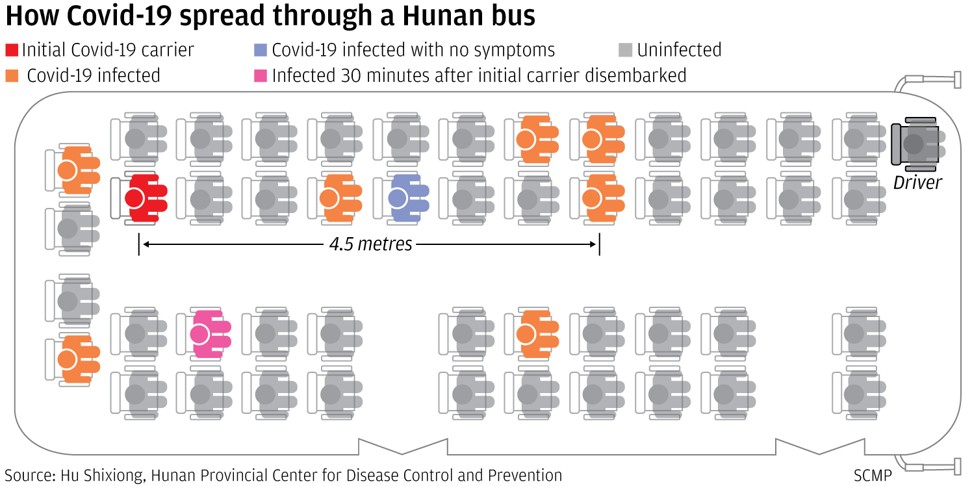
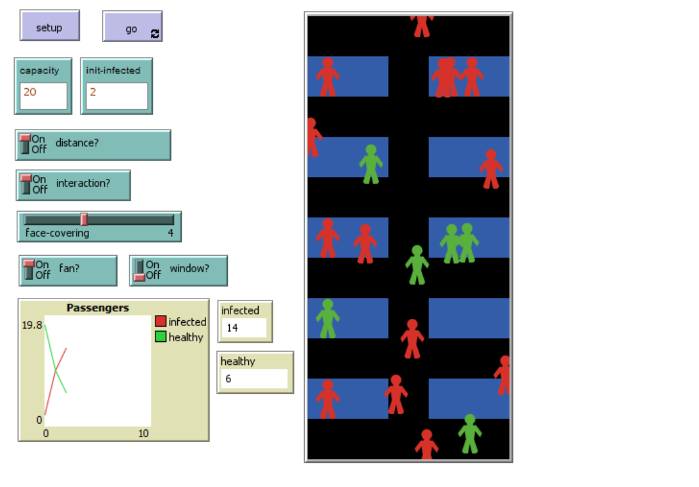
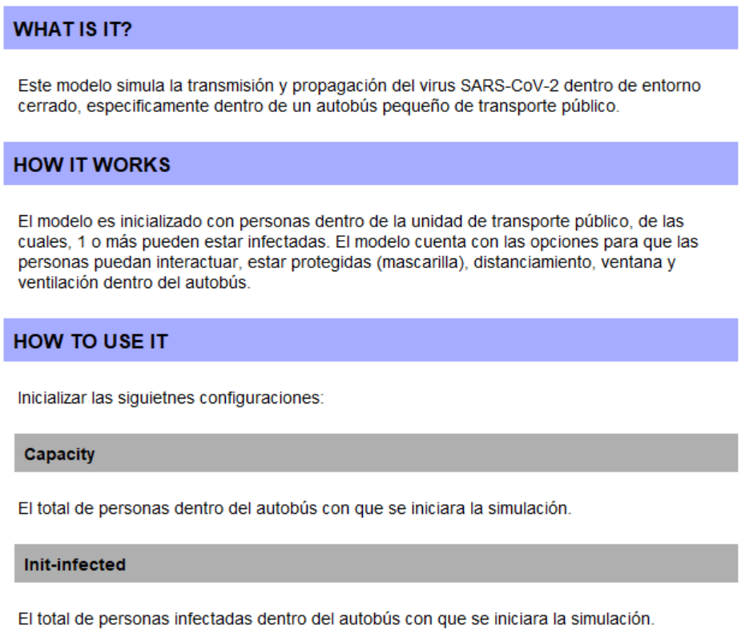
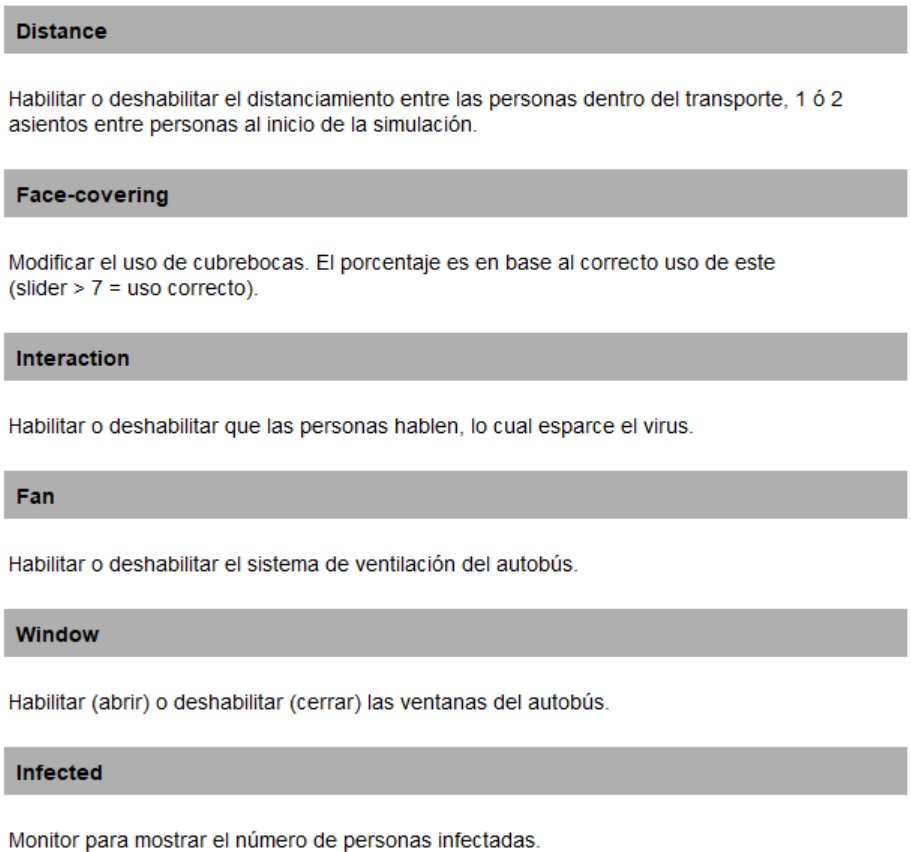
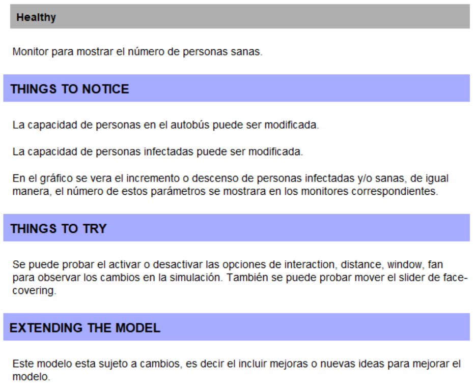
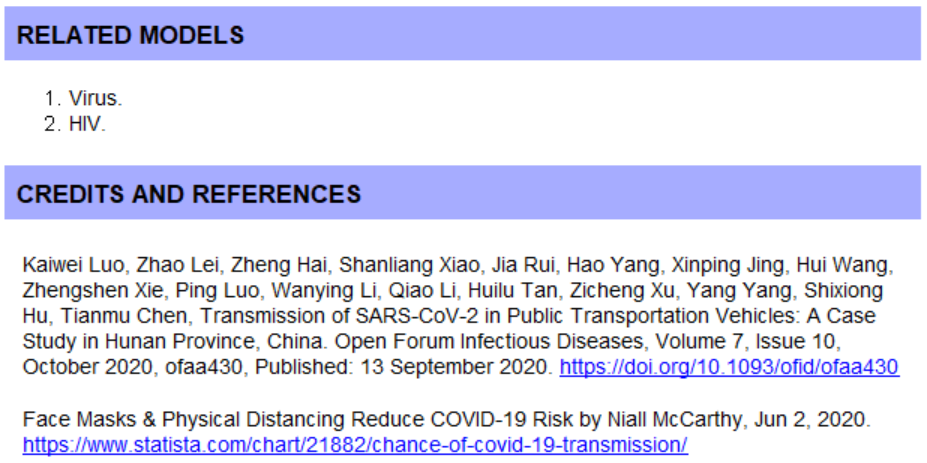

# Simulacion
Proyecto de la materia hecho en netlogo. 

## Tabla de Contenido
- [Información General](#información-general)
- [Interfaz Principal](#interfaz-principal)
- [Información Detallada](#información-detallada)

## Información General
Este trabajo consiste en simular la propagación del virus SARS-CoV-2 dentro de un autobús de pasajeros.

	

## Interfaz Principal
Esta es la interfaz al abriri el archivo en el programa NetLogo.

	

## Información Detallada
Aquí se muestran las imágenes con los detalles del proyecto.

	
  	
  	
  	

